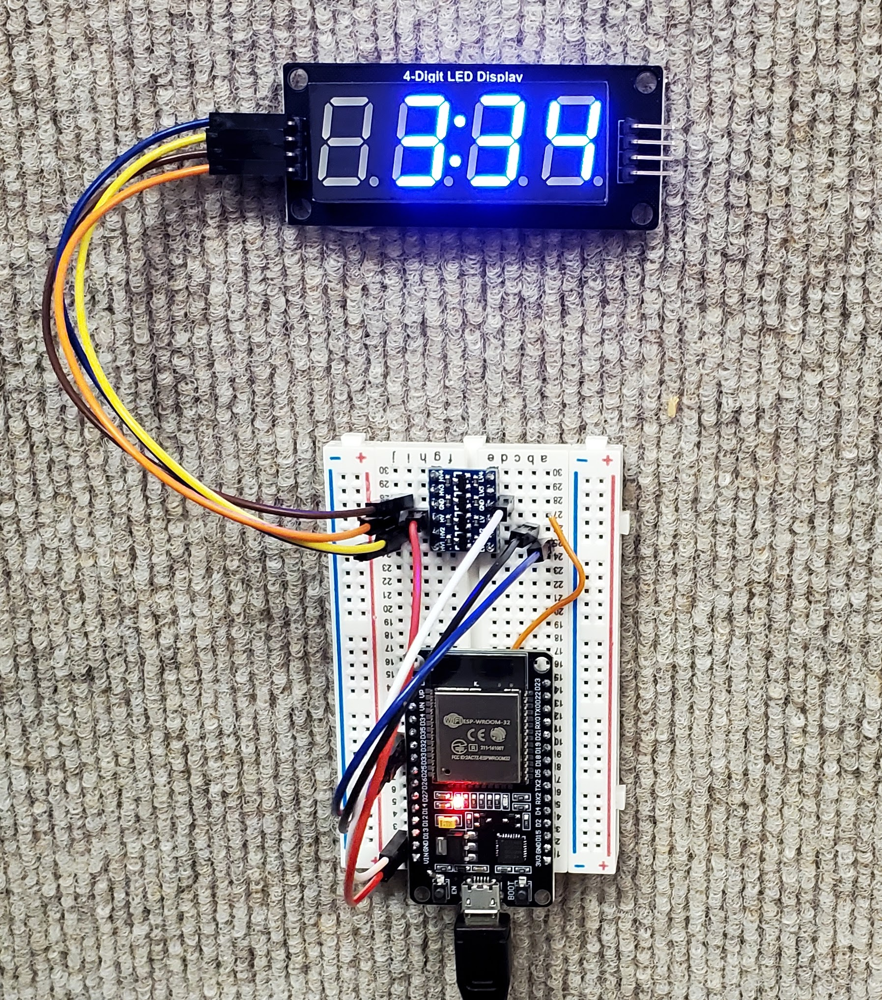

# 7-segment clock

This project contains the code and instructions needed to build a clock that uses a 7-segment display to show the time,
keeps itself up to date, and automatically adjusts for daylight savings time.

## Supplies

You will need:

* An ESP32 dev board
* A 4-digit 7-segment display that uses an onboard TM1637 driver
* A level shifter that can shift 3.3v to 5v
* A USB phone charger or other power supply for the ESP32
* A breadboard + jumper wires, or a perfboard + soldering iron + jumper wires if you want to make something more permanent
* A computer with Arduino IDE to program the whole thing
* A USB micro-B cable to connect the ESP32 to your computer

## Instructions

TBD - I plan to toss a Fritzing wiring diagram onto this page at some point. In the mean time, reference the photo
above for how to wire it up. (Note that the wire sticking out from under the ESP32 is connected to the 3.3v power pin.)
Then open 7-segment-clock.ino with Arduino IDE, install libraries ([TM1637](https://www.arduino.cc/reference/en/libraries/tm1637/), [acetime](https://www.arduino.cc/reference/en/libraries/acetime/) and [ESPNtpClient](https://github.com/gmag11/ESPNtpClient)), fill in the SSID and password of your WiFi network, connect your ESP32
to your computer, program it, then hook it up to your phone charger and you're off to the races.

